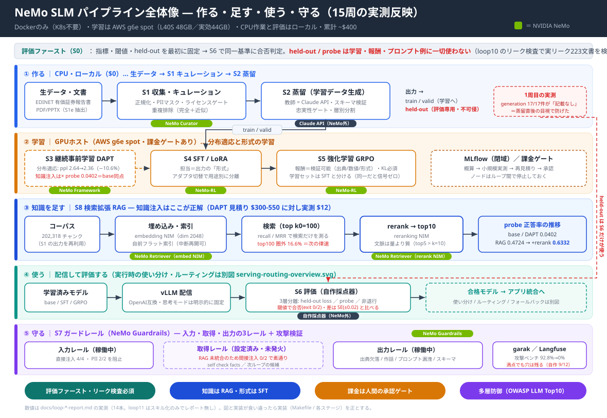

# ローカルLLM構築ハンズオン教材（金融ドメインRAG・一般化版）

> ℹ **一般化サンプル**です。特定顧客の固有情報は含みません。セクター体系・コスト数値・
> 執筆者スタイルは例示であり、各自の実データ・実値に置き換えて利用してください。
> 学習・検証目的のサンプルであり無保証（MIT License）。

「金融マーケットレポート向けRAGアシスタント」を題材に、ローカルLLMを
**作る（データ→蒸留→学習→評価）・使う（アプリ統合・コスト最適化）・守る（ガードレール）**
までを、Linuxコンテナ完結（**Kubernetes不要**）で体験する教材。

**主目的: NVIDIA NeMoシリーズ（Curator / Framework / RL / Evaluator / Guardrails / Retriever）でパイプラインを構築し、動かす環境を作ること。** `nemo-pipeline/` が本流で、フロンティアAPI・OpenShell等は代替・補完オプション。

## 全体像



`architecture-overview.svg` … 作る（学習）・使う（配信/評価）・守るの流れを1枚で俯瞰（CPU/GPUゾーン・NeMoライブラリ緑タグ・held-out分離）。


`serving-routing-overview.svg` … **使う（推論構成）の別図**。学習とは別に、複数モデルを役割で使い分ける実行時アーキ（LiteLLMルーティング・RAG検索・品質ゲート・Claudeフォールバック・ガードレール）。

## 2つのルート

| ディレクトリ | 内容 | 主な読み手 |
|---|---|---|
| **`nemo-pipeline/`** | NVIDIA NeMoライブラリ群でのパイプライン構築（S0評価設計→S7ガードレール）。実装済スクリプト＋Makefile＋E2Eランブック | パイプラインを手を動かして作る人 |
| **`local-rag-llm/`** | 学習済みモデルを既存チャットアプリへ統合する設計（LiteLLMルーティング・品質ゲート）＋compose/DevContainerテンプレート | アプリに組み込む人 |

## まず動かす（API・GPU不要・数分）
```bash
cd nemo-pipeline
make setup
make curate distill-dry eval-dry     # データ整形→蒸留配管→評価配管 をローカルで検証
```
✅ `"pass": true` が出れば配管はOK。続きは `nemo-pipeline/docs/10-runbook.md`（E2E手順）へ。

## 読む順番
1. `nemo-pipeline/README.md` … 構成図・K8s不要の理由・公式マニュアルリンク
2. `nemo-pipeline/docs/00-environment.md` … 必要なアカウント/APIキー、閉域MLflow
3. `nemo-pipeline/docs/02-makefile-coverage.md` … makeでどこまで自動化されるか
4. `nemo-pipeline/docs/03-accounts-and-datasets.md` … 必要なアカウント一覧・データセットのライセンス（商用可否）
5. `nemo-pipeline/docs/10-runbook.md` … 取得→蒸留→学習→評価→ガードレールの一本道
6. `nemo-pipeline/docs/04-dataset-templates.md` … 文書→データセット/メタデータの作成テンプレート
7. `nemo-pipeline/docs/05-proprietary-data-design.md` … 独自データを将来学習に使う設計（承認・PII・用途制御）
   - `nemo-pipeline/docs/07-openshell-egress-governance.md` … （任意）OpenShellで出口ガバナンスを足す補完設計
   - `nemo-pipeline/docs/08-multimodal-documents.md` … **PPTX/PDF・図表入り文書を学習データにする設計**（NeMo Retriever抽出・VLMキャプション・要素別ポリシー）
8. `local-rag-llm/…-implementation-design.md` … アプリ統合の設計

## セキュリティ（利用前に必ず）
- 公開されているのは**雛形**です。`*.env.example` を基に自分の `.env` を作成（`.gitignore`済）。
- 強いキー生成: `openssl rand -hex 32`。本番は SOPS+age 暗号化を推奨。
- app等は `127.0.0.1` バインド。外部提供は TLS＋認証リバースプロキシ経由のみ。
- 詳細チェックリスト: `local-rag-llm/templates/README.md` のセキュリティ節。

## Claude Code で自動運転する
`claude-skills/nemo-pipeline-runner/` に、パイプライン一式を評価ループ付きで運転させる
Claude Codeスキルを同梱（承認ゲート・分岐表・失敗対処つき）。導入は `claude-skills/README.md`。

## 前提ソフト
Docker（GPUステージのみ NVIDIA Container Toolkit）。K8s不要。詳細は各docs参照。

---
本教材の設計原則: **評価ファースト**（指標・閾値・held-outを先に固定しbaseを先に測る）/
検証可能報酬によるGRPO / フォールバック常設 / 多層防御。
