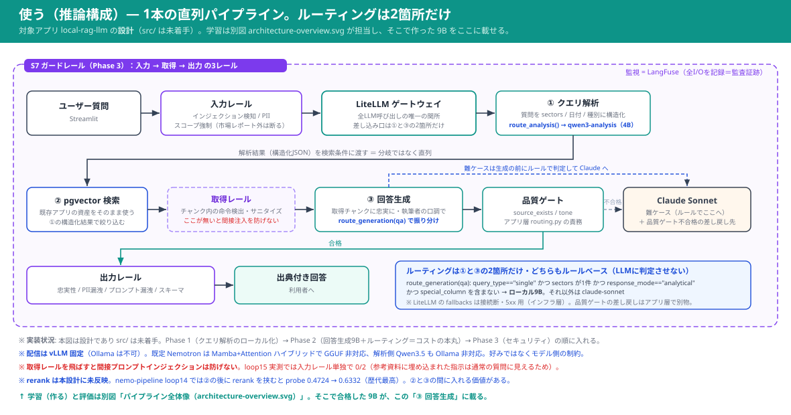

# NeMo LLMパイプライン（金融ドメイン特化・Linuxコンテナ完結）

データ収集 → 蒸留 → (事前学習) → SFT → 強化学習(GRPO) → 評価 → ガードレール を
**NVIDIA NeMoのライブラリ層（無償・Apache 2.0）だけ**で貫くパイプライン。

## ❓ まず一番の疑問に答える: Kubernetesは要る？

**要りません。本パイプラインの全ステージは Docker（＋GPUステージのみ NVIDIA Container Toolkit）で完結します。**

| やること | 必要なもの | K8s |
|---|---|---|
| S1 収集・管理 / S2 蒸留 / S6 評価 | Docker のみ（CPUで可） | 不要 |
| S3/S4/S5 学習 | Docker + NVIDIA Container Toolkit（借りGPUホスト上） | 不要 |
| S7 ガードレール（library）＋garak検証 | Docker のみ | 不要 |
| 推論配信（llama.cpp / vLLM） | Docker + Container Toolkit | 不要 |
| ―――― ここから下は"将来"の話 ―――― | | |
| NeMo **microservices**（Customizer/Evaluator/Guardrails MS） | NVIDIA AI Enterprise（有償）+ **K8s** | 必要 |
| NIM を本番規模でオーケストレーション | 同上 | 必要 |

つまり **K8sが要るのは「microservices層に載せ替える将来」だけ**。Guardrailsは library の設定が
microservice にそのまま移行できる形式なので、今 library で作ることが将来の布石になります。
初構築は「Docker+Makefileで全部やる」で正解です。

## 🗺 構成図


> 緑タグ＝各ステージで使うNVIDIA NeMoライブラリ。赤破線＝held-out（学習に使わず評価専用）。
> **「使う」＝アプリでのモデル使い分け/RAG/ルーティングは実行時の別アーキ**なので別図に分離: `docs/serving-routing-overview.svg`



```
                     ┌──────────────────────── ローカルLinux（CPUコンテナ, K8s不要） ───────────────────────┐
                     │                                                                                      │
  HF/公開データ ──▶ [S1 収集・管理] ──▶ [S2 蒸留・メタデータ] ─────────────┐                                 │
  ダミー問合せ       NeMo Curator流       教師=Claude Sonnet               │ train/valid/【heldout】         │
                     正規化/品質/PII/     スキーマ検証+忠実性ゲート        ▼                                 │
                     ライセンス/重複排除  (source_exists=報酬と同一関数)  /data/distilled                    │
                     └──────────────────────────────────────────────────────────────────────────────────────┘
                                                       │ train/valid のみ（heldoutは渡さない）
                     ┌───────────────── 借りGPUホスト（EC2 NGC / Brev, Dockerのみ） ─────────────┐
                     │   [S3 DAPT(任意)] ─▶ [S4 SFT/LoRA] ─▶ [S5 GRPO(NeMo-RL)]                  │
                     │    NeMo Framework      NeMo Framework    報酬=common/reward.py            │
                     └───────────────────────────────│─────────────────────────────────────────┘
                                                     ▼ checkpoints → 配信(bf16/fp8)
        ┌─────────────────────────── ローカル/GPUホスト ───────────────────────────────┐
        │ [推論配信 llama.cpp/vLLM(OpenAI互換)] ◀─── [S6 評価 s6_eval.py]              │
        │            ▲                                heldoutで base vs SFT vs GRPO     │
        │            │                                閾値未達=exit2（前段に戻る）      │
        │ [S7 NeMo Guardrails server:8100] ◀── 検証: nemoguardrails evaluate + garak   │
        └───────────────────────────────────────────────────────────────────────────────┘
```

原則: **評価ファースト**（S0で指標・閾値・heldoutを固定し、baseを先に測ってから学習）。

## 📁 ディレクトリ（フェーズごと・各READMEあり）

| ディレクトリ | ステージ | 主なファイル |
|---|---|---|
| `common/` | 共有コード | reward.py（検証可能報酬）/ schema.py / prompts.py |
| `s0_eval_design/` | S0 評価設計 | thresholds（eval.yamlに集約）とbase測定の手順 |
| `s1_curation/` | S1 収集・管理 | s1_curate.py（実装済）/ fetch_jafin.py |
| `s2_distillation/` | S2 蒸留 | s2_distill.py（実装済・--dry-runあり） |
| `s3_pretraining/` | S3 DAPT(任意) | run_dapt.sh / dapt.yaml（骨子） |
| `s4_sft/` | S4 SFT/LoRA | run_sft.sh / sft_lora.yaml（骨子） |
| `s5_rl/` | S5 GRPO | grpo_qwen.yaml（NeMo-RL examplesを正とする） |
| `s6_evaluation/` | S6 評価 | s6_eval.py（実装済・合否exit code）/ eval.yaml |
| `s7_guardrails/` | S7 ガードレール | config/（config.yml + rails.co）/ garak_rest.json |
| `docs/` | 文書 | 00-environment / 01-plan / 10-runbook / 20-test-scenarios |

## 🖥 ローカルGPU(64GB)がある場合
学習の大半をローカルで完結できる（Route L）: 4B全工程◎ / 9B SFT◎ / **9B GRPO=ギリギリ可**（絞りノブあり）。
手順は `docs/10-runbook.md` Step 5-L、VRAM現実表と注意は `docs/00-environment.md` を参照。
推論ホスト兼用時は学習中に推論を止める運用にすること。

## 🔒 クローズネットワーク対応
実験トラッキングは **MLflow(セルフホスト)+TensorBoard+Langfuse** の3点で外部SaaSゼロ（W&B不使用）。
MLflowはNeMo-RL/NeMo Frameworkが公式対応。唯一外に出るのはS2蒸留の教師API（対処はdocs/00-environment.md）。

## 🚀 クイックスタート

```bash
make setup
make curate distill-dry eval-dry     # API・GPU無しで配管を検証（数分）
# 以降は docs/10-runbook.md（E2Eランブック）へ
```

## 📚 公式マニュアル（リンクは変わることがあるため一次情報を優先）

| 対象 | リンク |
|---|---|
| NeMo Framework | https://docs.nvidia.com/nemo-framework/user-guide/latest/ |
| NeMo Curator | https://github.com/NVIDIA-NeMo/Curator / https://docs.nvidia.com/nemo/curator/ |
| NeMo-RL | https://github.com/NVIDIA-NeMo/RL / https://docs.nvidia.com/nemo/rl/ |
| NeMo Evaluator | https://github.com/NVIDIA-NeMo/Eval / https://docs.nvidia.com/nemo/evaluator/ |
| NeMo Guardrails | https://github.com/NVIDIA-NeMo/Guardrails / https://docs.nvidia.com/nemo/guardrails/ |
| NGCカタログ/APIキー | https://catalog.ngc.nvidia.com / https://ngc.nvidia.com/setup |
| garak（レッドチーミング） | https://github.com/NVIDIA/garak |
| MLflow（実験トラッキング・閉域） | https://mlflow.org/docs/latest/ |
| NVIDIA Container Toolkit | https://docs.nvidia.com/datacenter/cloud-native/container-toolkit/latest/ |

**既定モデル= NVIDIA-Nemotron-Nano-9B-v2-Japanese（商用可・vLLM配信）→ `docs/06-nemotron-model.md`**

**必要なアカウント一覧・データセットのライセンス（商用可否）→ `docs/03-accounts-and-datasets.md`**

次に読む: `docs/00-environment.md`（アカウント・APIキー）→ **`docs/02-makefile-coverage.md`（makeの守備範囲・閉域準備）** → `docs/10-runbook.md`（E2E手順）
